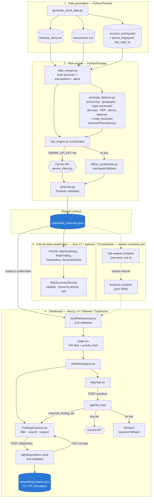

# Financial Risk Signal Aggregator

AI prototype that ingests structured transaction data, account activity, and unstructured
external alerts, correlates them per account (including across accounts), and produces a
prioritised, analyst-ready risk summary with a review workflow on top.

## Solution architecture and design flow

Four layers, one shared JSON contract (`output/risk_summary.json`) passed between them.
Detection is deterministic and auditable; only synthesis (scoring + rationale) and NLQ call an
LLM — and both have an offline fallback so the system never hard-depends on a live API key.



**Data flow, in order:**
1. `generate_mock_data.py` produces the three synthetic source files.
2. `data_merger.py` fuses them per account; `anomaly_detector.py` runs nine deterministic
   detectors (six single-account rules, three entity-resolution rules) over the fused data.
3. `risk_engine.py` sends the fused data + detector signals to Gemini (or the offline
   synthesizer if no key is set), validates the result against the Pydantic schema, and writes
   `output/risk_summary.json` — the single contract every other layer reads.
4. The **Java** layer independently loads and validates that same file for an internal
   case-management-style service (grouping, sorting, priority rollups).
5. The **Next.js dashboard** re-validates the file with Zod, renders it, and adds two write
   paths back into the system: the NLQ chat (`/api/nlq`, Gemini or a local keyword parser) and
   the disposition workflow (`/api/dispositions`, persisted to its own JSON file rather than
   mutating the AI-generated summary).
6. **Docker Compose** wires the risk engine (one-shot) and the dashboard (long-running) together
   over a shared volume so `docker compose up --build` runs the whole thing end-to-end.

## Approach

Four stages, each owned by the stack best suited to it:

1. **Ingest** (`data_pipeline/generate_mock_data.py`, Python/Pandas) — produces a synthetic
   dataset: `transactions.csv`, `account_activity.json`, `external_alerts.txt`.
2. **Detect** (`backend/anomaly_detector.py`, Python/Pandas) — deterministic rules scan the
   fused transaction/account data for structuring, high-risk-geography exposure, rapid fund
   movement, dormant-account reactivation, PEP cross-border activity, device-change +
   large-transfer patterns, and **entity resolution** — accounts sharing a device fingerprint,
   a login IP, or a wire beneficiary. This gives the LLM stage a grounded, auditable starting
   point instead of asking it to spot anomalies (or relationships) in raw rows.
3. **Synthesize** (`backend/gemini_client.py`, `backend/prompt_templates.py`) — the detector
   signals, fused account data, and external alert text are sent to the **Gemini API** with a
   fixed JSON schema (see `backend/prompt_templates.py:RESPONSE_SCHEMA`). Gemini correlates
   signals across sources, assigns a 0-100 risk score and priority, and writes a rationale
   grounded in the evidence it was given. If `GEMINI_API_KEY` is not set, `backend/offline_synthesizer.py`
   reproduces the same JSON contract with rule-based scoring, so the pipeline and dashboard
   run end-to-end with no API key (`generation_mode` in the output records which path ran).
   Before anything is written to disk, the result is validated against a **Pydantic** schema
   (`backend/schemas.py`) — a malformed summary is refused rather than silently persisted.
4. **Review** — `datamodels/` (Java) models the same JSON contract as typed POJOs, validates
   it, and exposes grouping/sorting used by an internal case-management style backend.
   `frontend/` (Next.js + Tailwind) renders the same file as a dashboard: KPI tiles, a
   priority breakdown, a plain-English chat panel over the findings, and a filterable/searchable
   table where each row can be dispositioned (True Positive / False Positive / Escalated).

All four stages read/write one shared contract: `output/risk_summary.json` (schema in
`backend/prompt_templates.py`, mirrored by `backend/schemas.py` and `frontend/lib/schemas/risk.ts`),
copied to `frontend/public/data/risk_summary.json` for the dashboard.

## Tools used

- **Python 3 + Pandas** — mock data generation, ingestion, fusion, rule-based anomaly detection
- **Pydantic** — validates `risk_summary.json` against the contract before it's ever written
- **Gemini API** (`google-generativeai`, `gemini-3.5-flash` by default) — risk correlation,
  scoring, and rationale generation, with a deterministic offline fallback for demoing without
  an API key; the frontend's chat panel calls the same API directly via `fetch` for NLQ
- **Java 17 + Jackson + Maven** — typed data models and an internal validation/prioritisation
  service over the risk summary JSON
- **Next.js 14 (App Router) + TypeScript + Tailwind CSS** — the compliance-facing dashboard
- **Zod** — validates `risk_summary.json` again on the frontend, plus every API request body
  (disposition updates, NLQ questions), so a malformed payload never reaches business logic
- **pytest** — unit/integration coverage for the detectors and the offline synthesizer's schema
  conformance
- **Docker Compose** — one-command orchestration of the pipeline + dashboard

## Data assumptions

- All data is synthetic, generated with a fixed random seed (`SEED = 42`) for reproducibility —
  no proprietary or client data is used. Derived identifiers (device fingerprints, login IPs) are
  built from `hashlib.sha256(account_id)`, not Python's built-in `hash()`, specifically so they
  stay reproducible across processes (`hash()` is randomized per run).
- 25 accounts, ~400-450 transactions over a 45-day window, with a handful of transactions and
  alerts deliberately injected to trigger each detector rule (structuring, high-risk geography,
  rapid movement, dormant reactivation) so the demo has something to find.
- Three entity-resolution scenarios are injected on top: `ACC-1003`/`ACC-1021` share a device
  fingerprint, `ACC-1012`/`ACC-1024` share a login IP, and `ACC-1004`/`ACC-1015` both wire the
  same beneficiary. `ACC-1021` and `ACC-1024` have no other signal at all — they're only flagged
  because of who they're linked to, which is the point of the feature.
- A beneficiary shared by more than `MAX_SHARED_BENEFICIARY_ACCOUNTS` (4) accounts is treated as
  a common payment recipient (payroll processor, utility, marketplace), not a mule cluster, and
  is deliberately **not** flagged — otherwise the 5 generic counterparties used to make the
  general transaction population look realistic would trip the detector for nearly every account.
- External alerts are short freeform text blocks, as a stand-in for watchlist hits, adverse
  media, sanctions screening, and fraud system output — the kind of unstructured signal that
  doesn't fit a transaction schema.
- `$10,000` is used as the illustrative CTR/structuring threshold; thresholds throughout
  (`backend/anomaly_detector.py`) are placeholders to be tuned against real policy in a
  production setting, not calibrated against actual regulatory guidance.
- A purely informational alert ("routine KYC refresh, no material change") is deliberately
  included and is *not* surfaced as a finding — evidence the system doesn't just flag every
  alert it sees.
- Disposition records (True Positive / False Positive / Escalated) are stored as a flat JSON
  file (`output/dispositions.json`), keyed by `finding_id`. That's enough to demonstrate the
  workflow end-to-end; a real deployment would use a database with per-analyst identity and an
  audit trail instead of `"updated_by": "analyst"`.

## Entity resolution

`backend/anomaly_detector.py` adds three account-linking detectors on top of the single-account
rules:

| Signal | Trigger | Severity |
|---|---|---|
| `SHARED_DEVICE_FINGERPRINT` | ≥2 accounts share the same `device_fingerprint` | HIGH |
| `SHARED_IP_ADDRESS` | ≥2 accounts share the same `last_login_ip` | MEDIUM (weaker — could be a household/NAT) |
| `SHARED_BENEFICIARY` | 2–4 accounts wire the same `counterparty_id` | HIGH |

Each side of a link gets its own finding referencing the other account(s), so a single shared
device can turn one flagged account into two, three, or more — without needing any new signal
on the newly-surfaced account. In the sample data this is what elevates `ACC-1003` to `CRITICAL`
and pulls in `ACC-1021`, which otherwise has a completely clean profile.

## Feedback / disposition workflow

Every row in the dashboard's findings table can be marked **True Positive**, **False Positive**,
or **Escalated**. Clicking a control:

1. Optimistically updates the UI.
2. `POST /api/dispositions` (`frontend/app/api/dispositions/route.ts`), validated against a Zod
   schema, persists `{finding_id, status, note?, updated_at, updated_by}` to
   `output/dispositions.json`.
3. `GET /api/dispositions` repopulates the table on load, so dispositions survive a refresh.

This is intentionally the same "grounded, evidence-linked" pattern as the risk findings
themselves — dispositions are a separate, auditable artifact rather than a mutation of the
AI-generated `risk_summary.json`.

## Natural-language query

The "Ask about the findings" panel (`frontend/components/NlqChat.tsx`) sends plain-English
questions to `POST /api/nlq`. That route re-reads and re-validates `risk_summary.json`
server-side (never trusts a client-supplied copy of the findings), then:

- If `GEMINI_API_KEY` is set, calls the Gemini API directly with the findings as grounding
  context and a fixed JSON response schema (`answer`, `matched_finding_ids`).
- Otherwise falls back to a small deterministic keyword parser (`frontend/lib/nlq.ts`) that
  understands priority ("critical"), category synonyms ("geography", "shared beneficiary",
  "mule"...), score thresholds ("above 70"), and account IDs.

Either path returns the same shape, and the matched finding IDs filter the table below the chat
— so the chat and the table are always showing the same underlying data.

## Schema validation

The JSON contract between the Python backend and the Next.js frontend is enforced twice,
independently:

- **Backend** (`backend/schemas.py`, Pydantic): `risk_engine.py` validates the synthesizer's
  output before writing `output/risk_summary.json` — an invalid summary raises instead of being
  persisted.
- **Frontend** (`frontend/lib/schemas/risk.ts`, Zod): `loadRiskSummary()` re-parses the same file
  before rendering; `frontend/types/risk.ts` re-exports the Zod-inferred types so compile-time
  types and the runtime contract can't drift apart. The same pattern validates disposition and
  NLQ API request bodies (`frontend/lib/schemas/disposition.ts`, `frontend/lib/schemas/nlq.ts`).

## Testing

```bash
pip install -r requirements-dev.txt
pytest
```
Covers: structuring detection (positive + two negative cases), the three entity-resolution
detectors (including that the beneficiary cluster cap correctly ignores a high-volume common
counterparty), and that the offline synthesizer's output validates against the Pydantic schema,
sorts by risk score, and excludes purely informational alerts.

## Setup

**Option A — Docker Compose (fastest path)**
```bash
docker compose up --build
```
Runs the data pipeline once (`risk-engine`, exits 0 on success), then starts the dashboard on
`http://localhost:3000`. Both containers share a volume so the frontend reads whatever the
pipeline just wrote. Pass a real key with `GEMINI_API_KEY=your_key docker compose up --build`
to use Gemini instead of the offline fallback for both the risk engine and the NLQ chat.

**Option B — run each layer directly**

1. **Data pipeline + risk engine (Python 3.10+)**
   ```bash
   pip install -r requirements.txt
   python data_pipeline/generate_mock_data.py
   cd backend
   export GEMINI_API_KEY=your_key_here   # optional — omit to use the offline fallback
   python risk_engine.py
   ```
   Writes `output/risk_summary.json` and copies it to `frontend/public/data/risk_summary.json`.

2. **Java data models (JDK 17+, Maven)**
   ```bash
   cd datamodels && mvn -q compile exec:java
   ```
   Loads `../output/risk_summary.json`, validates it, and prints findings grouped by priority.

3. **Dashboard (Node 18+)**
   ```bash
   cd frontend && npm install && npm run dev
   ```
   Open `http://localhost:3000`. The page and API routes are rendered on-demand
   (`export const dynamic = "force-dynamic"`), so re-running step 1 and refreshing the page
   picks up new data without rebuilding. Set `GEMINI_API_KEY` in the frontend's environment too
   if you want the chat panel to use Gemini instead of its offline parser.

## Example: input → output

**Input** — one transaction row (`data/transactions.csv`):
```
transaction_id,account_id,timestamp,amount,...,country,channel
TXN-STRU-8161,ACC-1003,2026-06-26T00:00:00,9800.00,...,US,WIRE
TXN-STRU-6580,ACC-1003,2026-06-27T03:00:00,9700.00,...,CA,WIRE
TXN-STRU-1485,ACC-1003,2026-06-28T06:00:00,9650.00,...,GB,WIRE
```
plus a matching external alert (`data/external_alerts.txt`) and a `device_fingerprint` in
`account_activity.json` that also appears on `ACC-1021`.

**Output** — the corresponding entries in `output/risk_summary.json`:
```json
{
  "finding_id": "FIND-001",
  "account_id": "ACC-1003",
  "risk_score": 95,
  "priority": "CRITICAL",
  "categories": ["EXTERNAL_ALERT", "SHARED_DEVICE_FINGERPRINT", "STRUCTURING"],
  "rationale": "3 transactions just under the $10,000 reporting threshold within 7 days. Device fingerprint FP-9F31C7A0 also used by ACC-1021 — possible mule network or shared access. STRUCTURING PATTERN.",
  "recommended_action": "Cross-reference linked accounts for common ownership or account takeover."
}
```
```json
{
  "finding_id": "FIND-007",
  "account_id": "ACC-1021",
  "risk_score": 35,
  "priority": "MEDIUM",
  "categories": ["SHARED_DEVICE_FINGERPRINT"],
  "rationale": "Device fingerprint FP-9F31C7A0 also used by ACC-1003 — possible mule network or shared access.",
  "recommended_action": "Cross-reference linked accounts for common ownership or account takeover."
}
```
`ACC-1021` has no structuring, geography, or alert signal of its own — the entity-resolution
detector is the only reason it appears at all. The dashboard renders both as rows; clicking one
expands the rationale and evidence, and either can be dispositioned or found via the chat panel
(e.g. asking "shared device").

## Possible enhancements

A conversational (multi-turn, memory-carrying) NLQ mode instead of single-shot Q&A; a proper
datastore (with auth and an audit trail) for dispositions instead of a flat JSON file; feeding
disposition outcomes back into detector thresholds (e.g. auto-suppressing a rule that's
consistently marked False Positive); streaming/real-time transaction ingestion instead of a
batch CSV; a CI pipeline that runs `pytest` and `next build` on every change.
